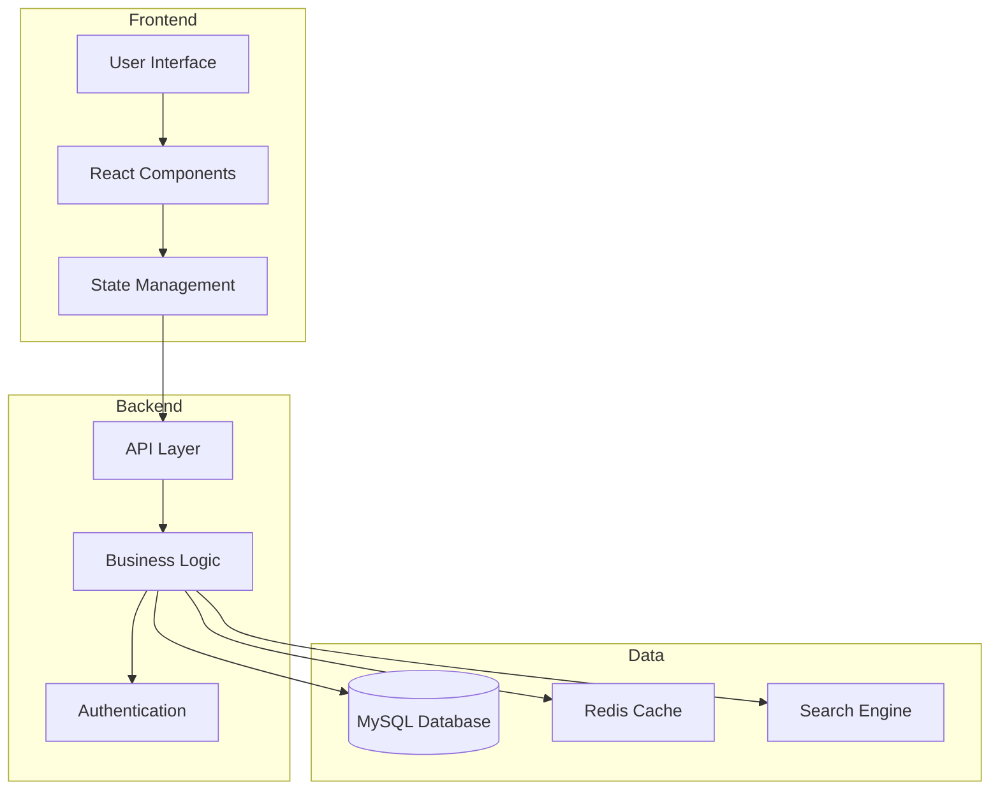
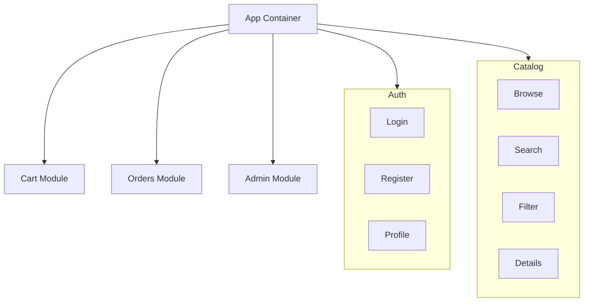
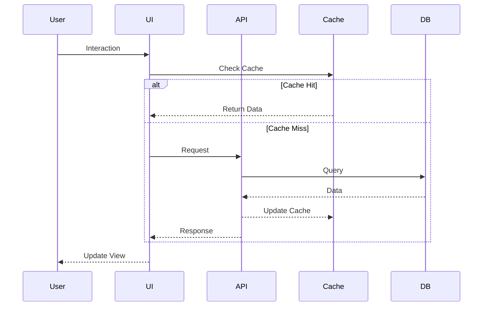
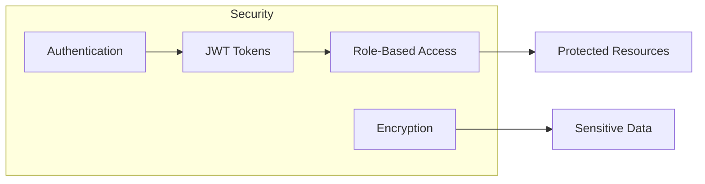
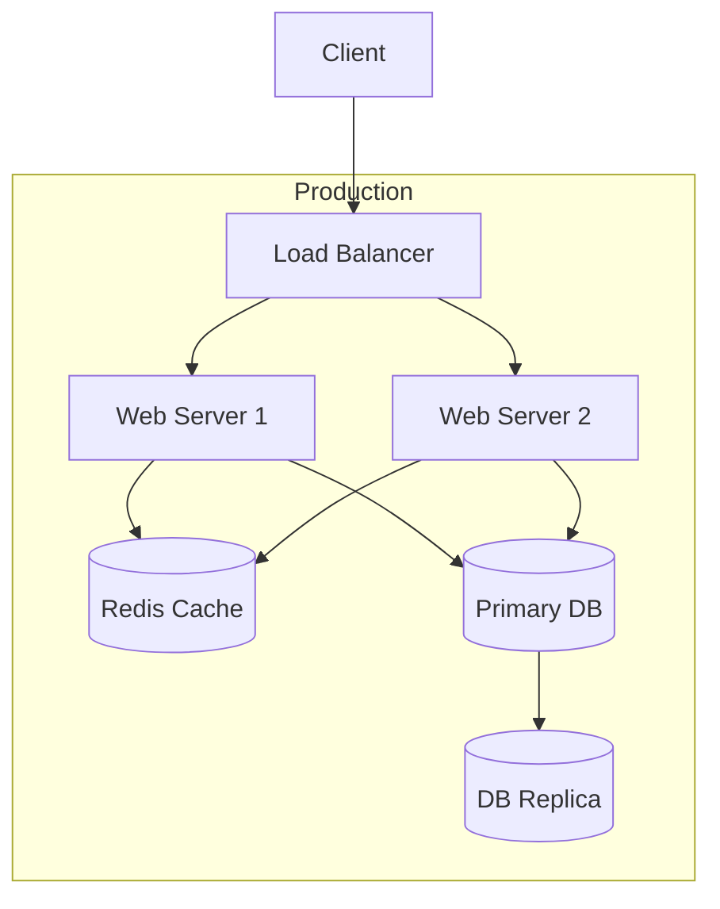

# System Architecture

## Overview

BookHaven is a modern online bookstore built with a focus on user experience, performance, and scalability. This document outlines the technical architecture and design decisions.

## Architecture Overview

## Component Architecture

## Data Flow

## Security Architecture

## Deployment Architecture

