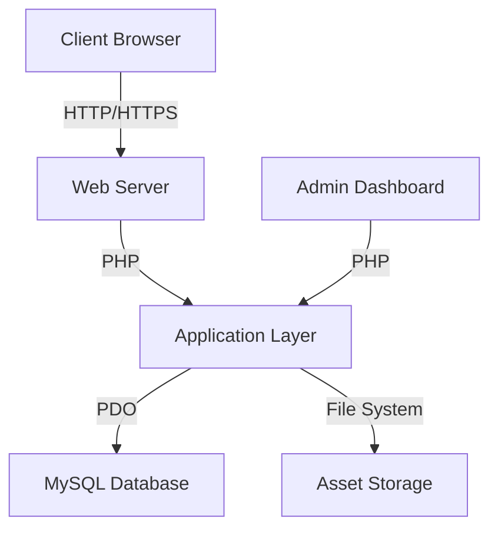
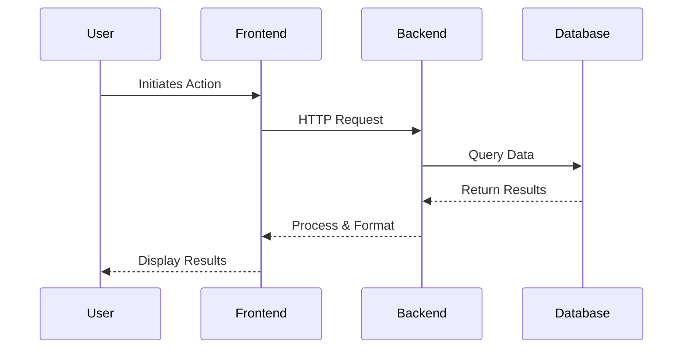
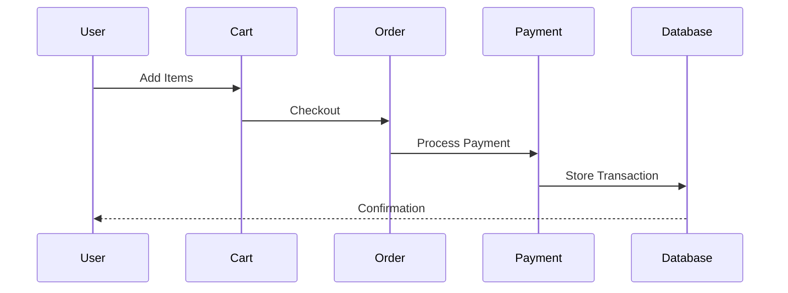

# System Architecture

## Overview

BookHaven is designed using a modular architecture that separates concerns between frontend, backend, and database layers. This document outlines the system's architecture, components, and their interactions.

## Architecture Diagram

## Components

### Frontend Layer
- HTML5 templates with PHP integration
- CSS3 with responsive design
- JavaScript for dynamic interactions
- AJAX for asynchronous operations

### Application Layer
- PHP controllers for request handling
- Business logic implementation
- Authentication and authorization
- Session management
- API endpoints

### Data Layer
- MySQL database
- PDO for database operations
- Prepared statements for security
- Transaction management

### Security Layer
- Password hashing
- CSRF protection
- XSS prevention
- Input validation
- Session security

## Data Flow

1. User Request Flow

2. Order Processing Flow

## Security Measures

1. Authentication
   - Session-based authentication
   - Password hashing with bcrypt
   - Remember-me functionality
   - Password reset capability

2. Authorization
   - Role-based access control
   - Resource-level permissions
   - API authentication

3. Data Protection
   - HTTPS enforcement
   - SQL injection prevention
   - XSS protection
   - CSRF tokens

## Performance Optimization

1. Database
   - Indexed queries
   - Prepared statements
   - Connection pooling
   - Query optimization

2. Frontend
   - Asset minification
   - Image optimization
   - Lazy loading
   - Browser caching

3. Backend
   - Response caching
   - Query caching
   - Optimized algorithms
   - Resource pooling