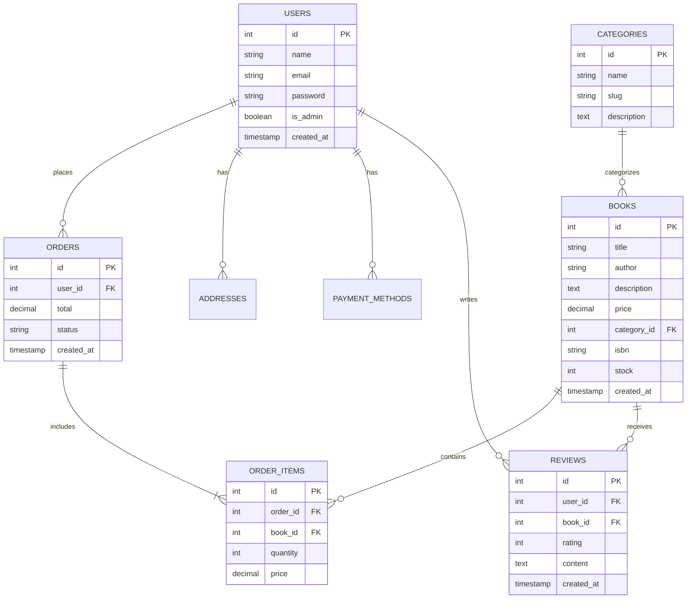

# Database Schema

## Overview

BookHaven uses MySQL for data storage. This document details the database schema, relationships, and key considerations.

## Entity Relationship Diagram

## Tables

### users
| Column | Type | Description |
|--------|------|-------------|
| id | INT | Primary Key |
| name | VARCHAR(100) | User's full name |
| email | VARCHAR(100) | Unique email |
| password | VARCHAR(255) | Hashed password |
| is_admin | BOOLEAN | Admin status |
| created_at | TIMESTAMP | Creation date |

### books
| Column | Type | Description |
|--------|------|-------------|
| id | INT | Primary Key |
| title | VARCHAR(255) | Book title |
| author | VARCHAR(100) | Author name |
| description | TEXT | Book description |
| price | DECIMAL(10,2) | Price |
| category_id | INT | Foreign Key |
| isbn | VARCHAR(20) | ISBN number |
| stock | INT | Stock quantity |
| created_at | TIMESTAMP | Creation date |

[Additional tables omitted for brevity]

## Indexes

### Primary Indexes
- All `id` columns are primary keys
- Auto-incrementing integers

### Secondary Indexes
- books(isbn)
- users(email)
- categories(slug)
- orders(user_id)

## Constraints

### Foreign Keys
- ORDER_ITEMS.order_id → ORDERS.id
- ORDER_ITEMS.book_id → BOOKS.id
- BOOKS.category_id → CATEGORIES.id
- REVIEWS.user_id → USERS.id
- REVIEWS.book_id → BOOKS.id

### Unique Constraints
- users.email
- books.isbn
- categories.slug

## Optimization

1. Query Optimization
   - Use appropriate indexes
   - Write efficient queries
   - Avoid N+1 problems

2. Data Integrity
   - Foreign key constraints
   - NOT NULL constraints
   - Default values

3. Performance
   - Regular maintenance
   - Query monitoring
   - Index optimization