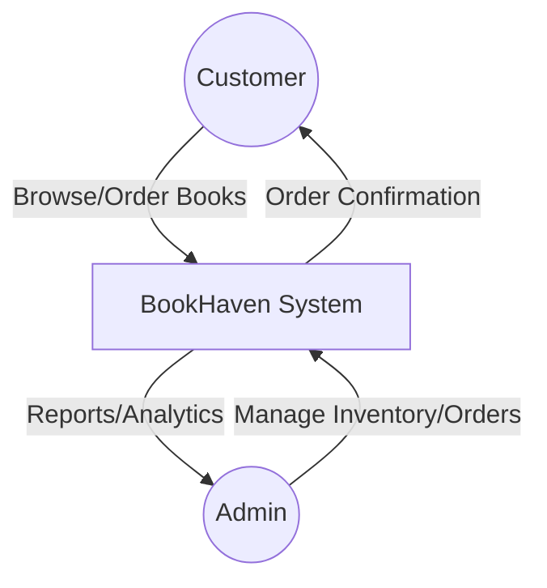
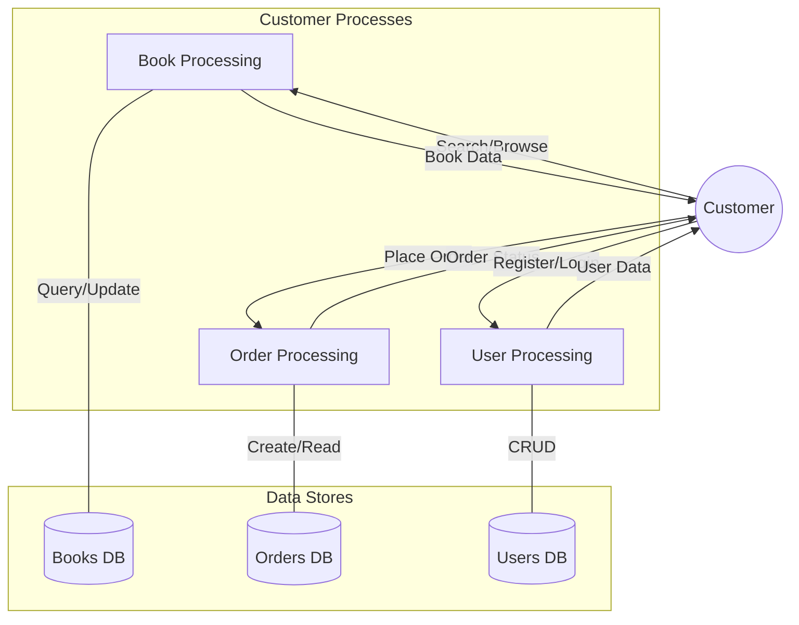
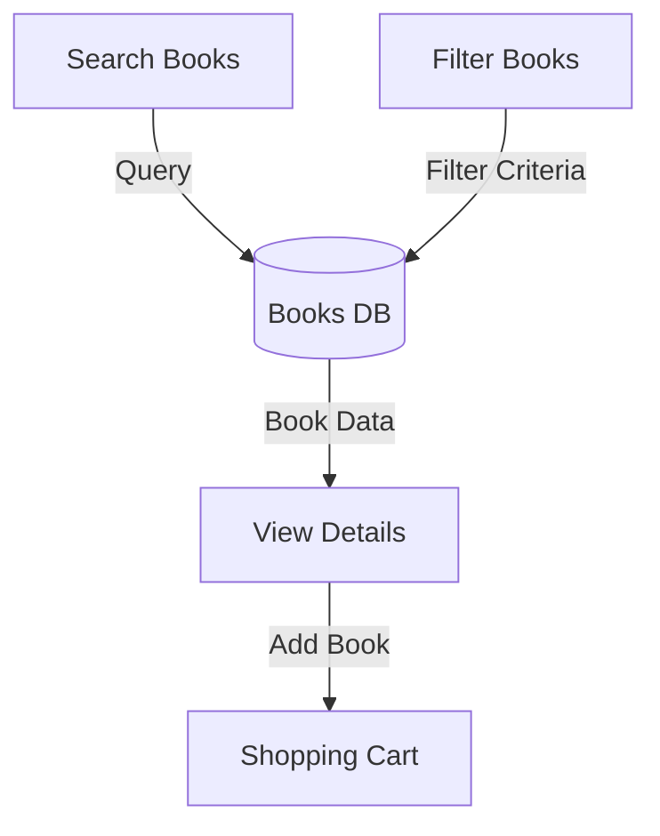
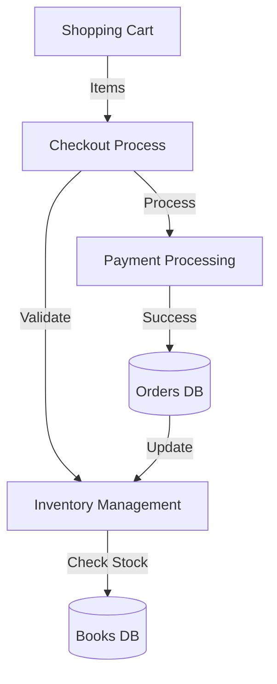
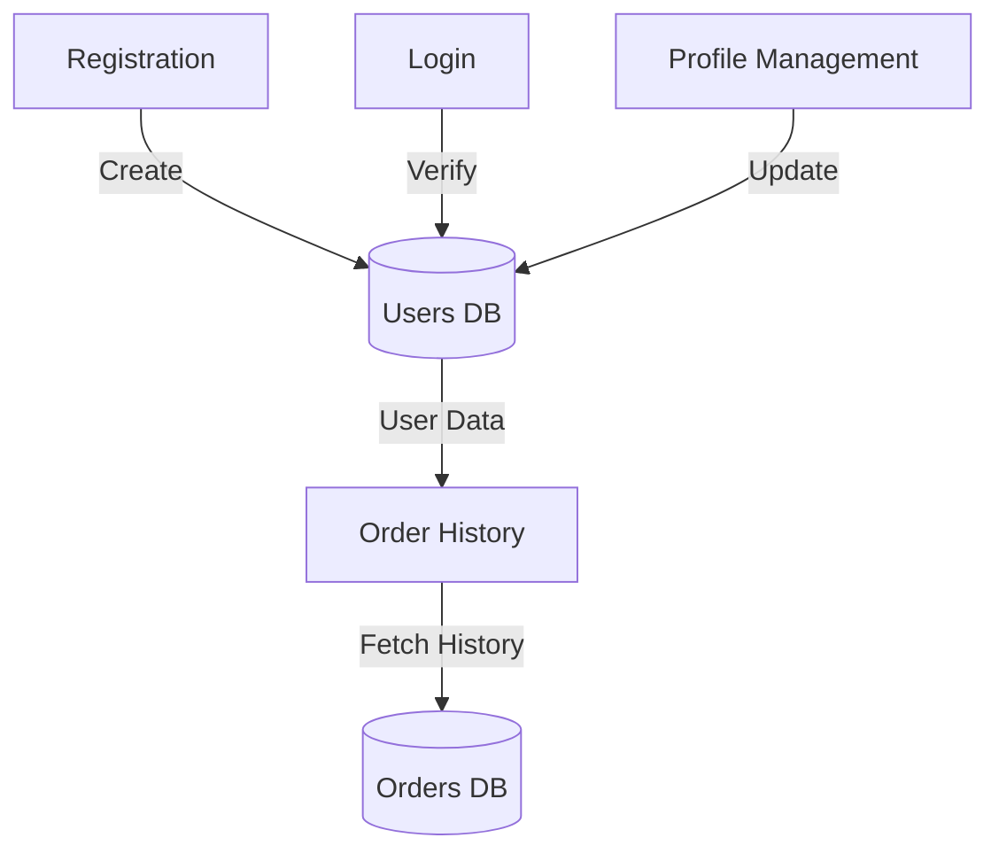
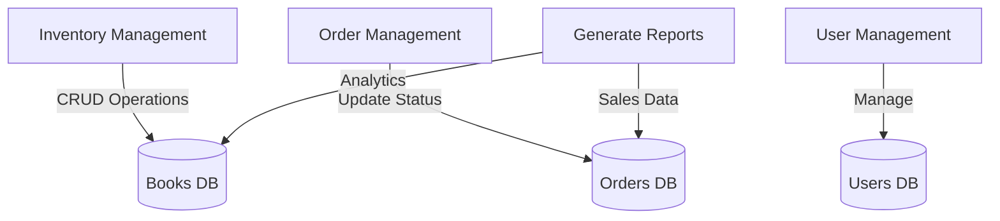

# Data Flow Diagrams

## Context Level (Level 0)

## Level 1: Main System Processes

## Level 2: Book Management Flow

## Level 3: Order Processing Flow

## Level 4: User Management Flow

## Level 5: Admin Flow

## Data Store Details

### Books Database
- Book ID
- Title
- Author
- Price
- Stock
- Category
- Description
- Cover Image

### Orders Database
- Order ID
- User ID
- Items
- Total Amount
- Status
- Payment Info
- Shipping Details

### Users Database
- User ID
- Name
- Email
- Password Hash
- Role
- Address
- Order History

## Data Flow Rules

1. **Authentication**
   - All user operations require valid session
   - Admin operations require admin privileges
   - Session timeout after inactivity

2. **Data Validation**
   - Input sanitization at all entry points
   - Business rule validation before storage
   - Referential integrity in database

3. **Error Handling**
   - Graceful error recovery
   - User-friendly error messages
   - Error logging for debugging

4. **Performance**
   - Caching for frequent queries
   - Pagination for large datasets
   - Optimized database queries