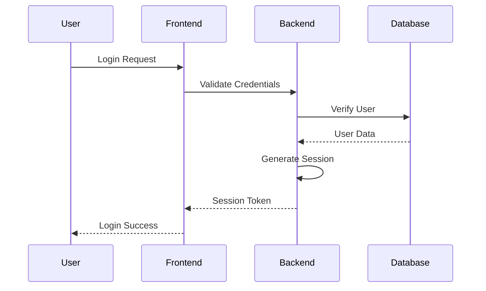

# Security Documentation

## Overview

This document outlines the security measures implemented in BookHaven to protect user data and system integrity.

## Authentication & Authorization

### User Authentication


### Password Security
- Passwords hashed using bcrypt
- Minimum password requirements:
  - 8 characters minimum
  - Mix of letters, numbers, symbols
  - Case sensitivity required
- Regular password rotation encouraged
- Secure password reset flow

### Session Management
- Secure session handling
- Session timeout after inactivity
- Session regeneration on privilege level change
- Concurrent session control

## Data Protection

### Input Validation
- Server-side validation
- Prepared statements for SQL
- XSS prevention
- CSRF protection

### Data Encryption
- TLS for data in transit
- Sensitive data encryption at rest
- Secure key management
- Regular security audits

## Access Control

### Role-Based Access
- User roles:
  - Admin
  - Customer
  - Guest
- Resource-level permissions
- Least privilege principle
- Regular access reviews

### API Security
- Token-based authentication
- Rate limiting
- Request validation
- Error handling

## Security Headers

```apache
# Apache Configuration
Header set X-Frame-Options "SAMEORIGIN"
Header set X-XSS-Protection "1; mode=block"
Header set X-Content-Type-Options "nosniff"
Header set Referrer-Policy "strict-origin-when-cross-origin"
Header set Content-Security-Policy "default-src 'self'"
```

## Security Checklist

- [ ] Regular security updates
- [ ] Automated vulnerability scanning
- [ ] Security logging and monitoring
- [ ] Incident response plan
- [ ] Regular security training
- [ ] Compliance monitoring
- [ ] Backup and recovery testing