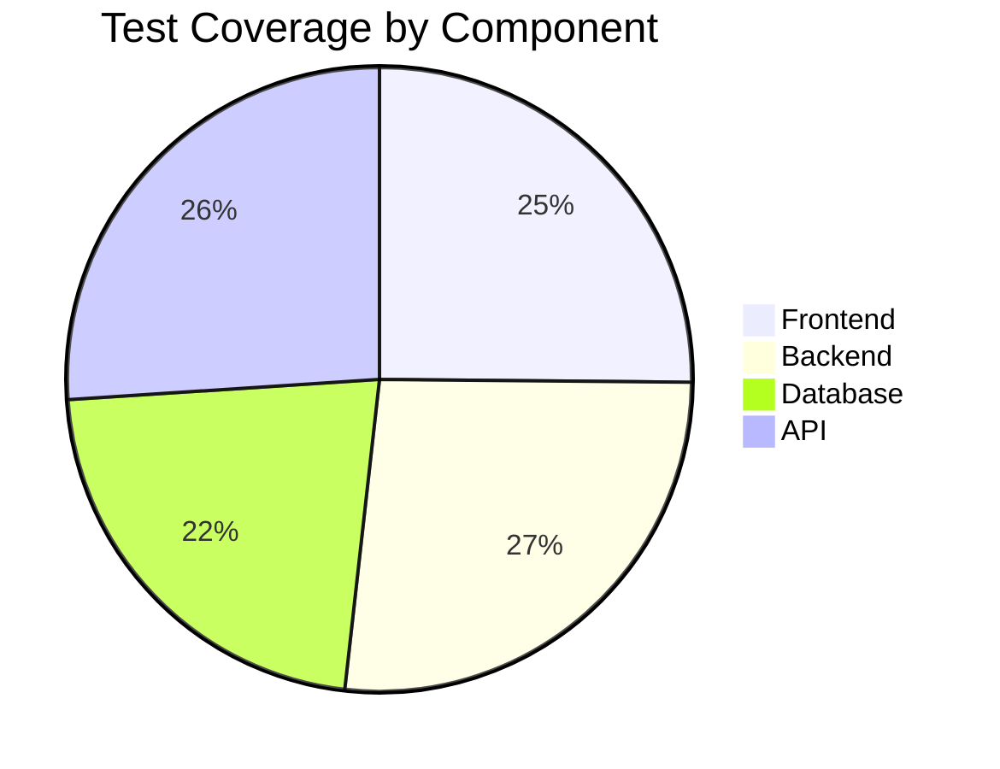
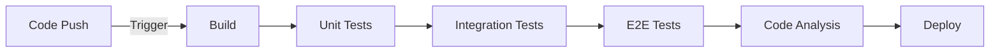

# Testing Documentation

## Overview

This document outlines the testing strategy and procedures for BookHaven.

## Testing Levels

### 1. Unit Testing

```php
// Example Unit Test
public function testBookPrice()
{
    $book = new Book();
    $book->setPrice(29.99);
    $this->assertEquals(29.99, $book->getPrice());
}
```

### 2. Integration Testing

```php
// Example Integration Test
public function testOrderCreation()
{
    $user = $this->createUser();
    $book = $this->createBook();
    $order = $this->orderService->createOrder($user, [$book]);
    $this->assertNotNull($order->getId());
}
```

### 3. End-to-End Testing

```javascript
// Example E2E Test
describe('Checkout Flow', () => {
    it('should complete purchase successfully', () => {
        cy.login();
        cy.addToCart('Book Title');
        cy.checkout();
        cy.get('.confirmation').should('be.visible');
    });
});
```

## Test Coverage



## Testing Tools

1. Unit Testing
   - PHPUnit
   - Jest

2. Integration Testing
   - PHPUnit
   - API Testing Suite

3. E2E Testing
   - Cypress
   - Selenium

## CI/CD Pipeline



## Performance Testing

1. Load Testing
   - Apache JMeter
   - K6

2. Stress Testing
   - Artillery
   - Gatling

## Security Testing

1. Static Analysis
   - SonarQube
   - PHP_CodeSniffer

2. Vulnerability Scanning
   - OWASP ZAP
   - Snyk

## Test Environment

1. Local Development
   - Docker containers
   - Test database

2. Staging
   - Mirror of production
   - Sanitized data

3. Production
   - Monitoring
   - Logging